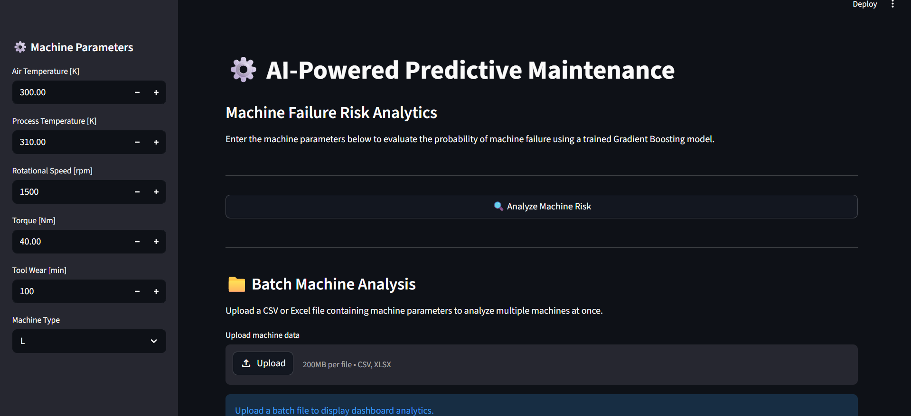
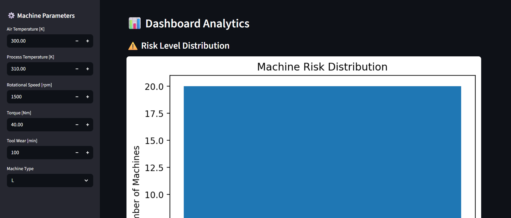
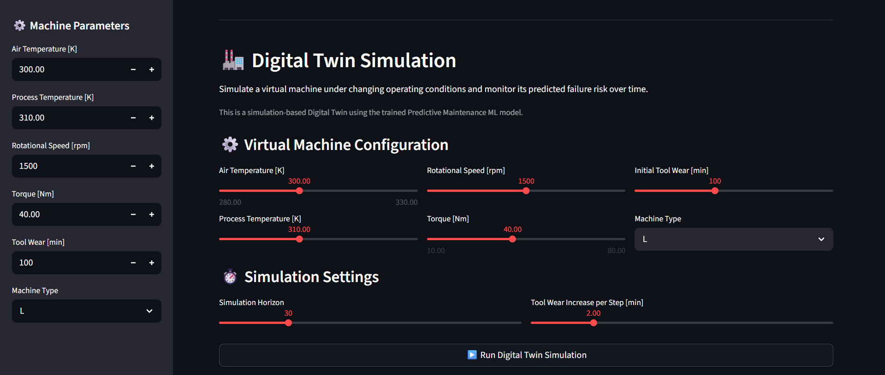
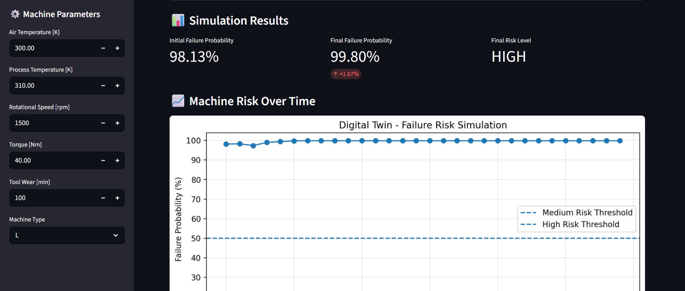
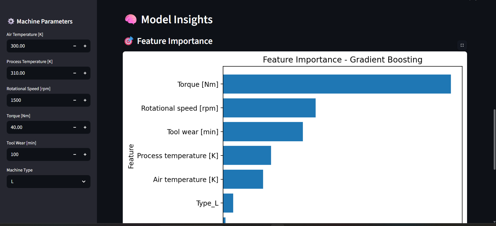

# ⚙️ AI-Powered Digital Twin for Predictive Maintenance

An AI-powered predictive maintenance system that combines Machine Learning, an interactive Streamlit dashboard, batch analysis, and a simulation-based Digital Twin to monitor machine failure risk under changing operating conditions.

---

## 📌 Project Overview

This project focuses on predicting machine failure and monitoring operational risk using Machine Learning.

The system uses the **AI4I 2020 Predictive Maintenance Dataset** and analyzes machine parameters such as:

- Air Temperature
- Process Temperature
- Rotational Speed
- Torque
- Tool Wear
- Machine Type

A trained Machine Learning model predicts the probability of machine failure, while the Streamlit dashboard provides an interactive interface for single-machine prediction, batch analysis, analytics, and Digital Twin simulation.

> **Note:** The Digital Twin component is simulation-based. It does not use live industrial sensor, PLC, or IoT data.

---

## 🚀 Features

- 🔍 Exploratory Data Analysis (EDA)
- 🤖 Machine Failure Prediction
- 📊 Comparison of multiple Machine Learning models
- 🎯 Hyperparameter tuning using GridSearchCV
- 📈 Failure probability estimation
- ⚠️ Machine risk classification
- 📁 Batch machine analysis using CSV files
- 📊 Interactive analytics dashboard
- 🏭 Simulation-based Digital Twin
- ⏱️ Failure risk monitoring over simulation steps
- 💡 Model insights and feature importance
- 🌐 Interactive Streamlit interface

---

## 🧠 Machine Learning

Several classification models were evaluated:

| Model | Accuracy | Precision | Recall | F1-Score |
|---|---:|---:|---:|---:|
| Logistic Regression | 97.02% | 75.69% | 19.57% | 30.68% |
| Balanced Logistic Regression | 82.25% | 13.74% | 80.44% | 23.46% |
| Random Forest | 97.89% | 91.50% | 41.72% | 57.06% |
| Gradient Boosting | 98.29% | 87.12% | 58.31% | 69.68% |
| Tuned Gradient Boosting | **98.47%** | **88.29%** | **63.84%** | **73.97%** |

The final model is a **Tuned Gradient Boosting Classifier**, selected based on cross-validation F1-score.

### Final Model

The model was tuned using `GridSearchCV` with 5-fold cross-validation.

Best parameters:

```text
learning_rate = 0.05
max_depth = 4
n_estimators = 200
```

- Accuracy: **98.47%**
- Precision: **88.29%**
- Recall: **63.84%**
- F1-Score: **73.97%**

On the held-out test set, the tuned Gradient Boosting model achieved:

- Accuracy: **98.8%**
- Precision: **94%**
- Recall: **69%**
- F1-Score: **80%**

---

## 📊 Dashboard

The project includes an interactive Streamlit dashboard for machine risk analysis.

### Single Machine Prediction & Batch Analysis

The dashboard allows users to enter machine operating parameters and receive a predicted failure probability and risk level.

It also supports batch analysis using CSV files.



---

## 📈 Dashboard Analytics

The analytics section provides visual insights into machine operating conditions and failure patterns.



---

## 🏭 Digital Twin Simulation

A simulation-based Digital Twin was added to extend the predictive maintenance system.

The Digital Twin creates a virtual machine configuration and simulates its condition over time.

Users can configure:

- Air Temperature
- Process Temperature
- Rotational Speed
- Torque
- Initial Tool Wear
- Machine Type
- Simulation Horizon
- Tool Wear Increase per Step

At each simulation step, the machine state is passed to the trained Machine Learning model to estimate the probability of failure.

### Simulation Workflow

```text
Virtual Machine
      ↓
Operating Conditions
      ↓
Simulation Over Time
      ↓
Machine State Update
      ↓
ML Failure Prediction
      ↓
Risk Level
      ↓
Risk Monitoring Over Time
```

### Digital Twin Configuration



### Digital Twin Simulation Results

The simulation visualizes how predicted failure risk changes over time as machine conditions evolve.



> The Digital Twin in this project is a simulation-based implementation built on top of the trained predictive maintenance model. It is intended to demonstrate how ML-based risk prediction can be integrated into a virtual machine monitoring workflow.

---

## 💡 Model Insights

The dashboard also provides model-related insights, including model performance and feature importance.



---

## 📂 Project Structure

```text
ai-powered-digital-twin-predictive-maintenance/
│
├── app.py
├── 01_data_exploration.ipynb
├── tuned_gradient_boosting_model.pkl
├── feature_names.pkl
├── batch_test.csv
├── requirements.txt
├── README.md
│
└── images/
    ├── dashboard.png
    ├── dashboard_analytics.png
    ├── digital_twin.png
    ├── digital_twin2.png
    └── model_insights.png
```

### File Description

| File | Description |
|---|---|
| `app.py` | Streamlit application containing the dashboard, predictions, batch analysis, analytics, and Digital Twin simulation |
| `01_data_exploration.ipynb` | Jupyter Notebook for data exploration, preprocessing, model training, evaluation, and hyperparameter tuning |
| `tuned_gradient_boosting_model.pkl` | Trained Tuned Gradient Boosting model |
| `feature_names.pkl` | Saved feature names used by the model |
| `batch_test.csv` | Sample CSV file for testing batch machine analysis |
| `requirements.txt` | Python dependencies required to run the project |
| `README.md` | Project documentation |
| `images/` | Screenshots used in the project documentation |

---

## 🛠️ Technologies

- Python
- Pandas
- NumPy
- Scikit-learn
- Matplotlib
- Seaborn
- Streamlit
- Joblib
- Jupyter Notebook

---

## ▶️ Installation & Usage

### 1. Clone the repository

```bash
git clone https://github.com/YOUR_USERNAME/ai-powered-digital-twin-predictive-maintenance.git
```

### 2. Navigate to the project directory

```bash
cd ai-powered-digital-twin-predictive-maintenance
```

### 3. Install dependencies

```bash
pip install -r requirements.txt
```

### 4. Run the Streamlit dashboard

```bash
streamlit run app.py
```

The dashboard will open in your browser.

---

## 📦 Dataset

This project uses the **AI4I 2020 Predictive Maintenance Dataset** from the UCI Machine Learning Repository.

The dataset contains 10,000 data points and includes machine operating parameters such as temperature, rotational speed, torque, tool wear, machine type, and machine failure.

Dataset source:

[UCI Machine Learning Repository – AI4I 2020 Predictive Maintenance Dataset](https://archive.ics.uci.edu/dataset/601/ai4i+2020+predictive+maintenance+dataset)

---

## 🔮 Future Improvements

Possible future improvements include:

- Integration with real-time IoT sensor data
- Real-time machine monitoring
- Live data streaming
- More realistic Digital Twin state transitions
- Additional predictive maintenance models
- Remaining Useful Life (RUL) prediction
- Deployment on cloud infrastructure
- Integration with industrial systems and PLCs

---

## 👩‍💻 Author

**Hasti**
